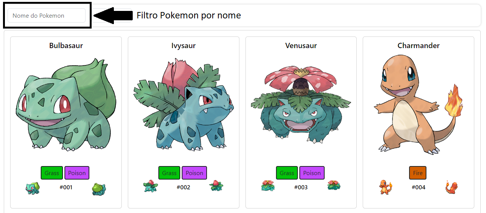
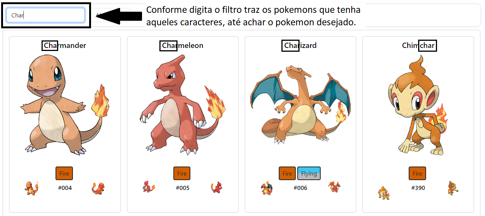
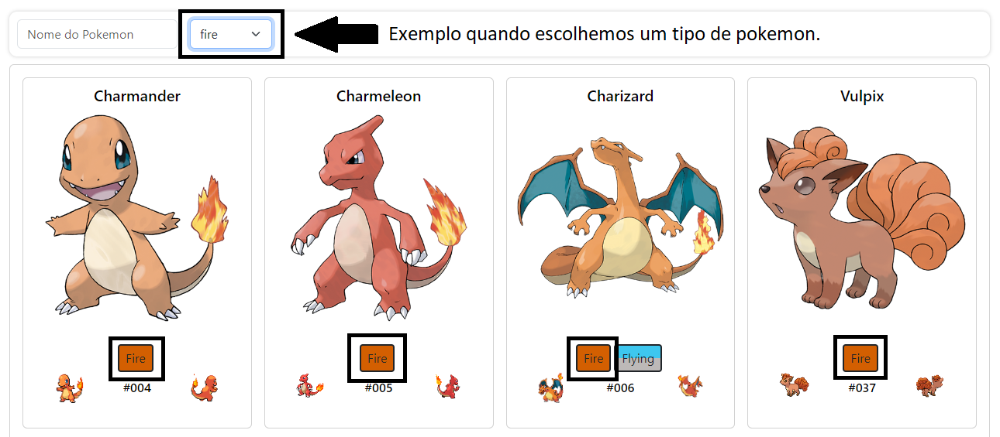
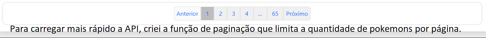
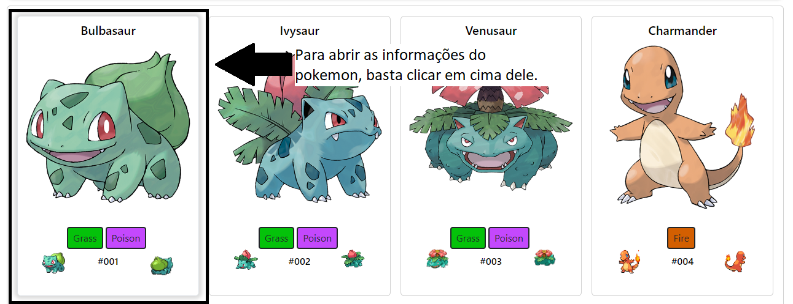
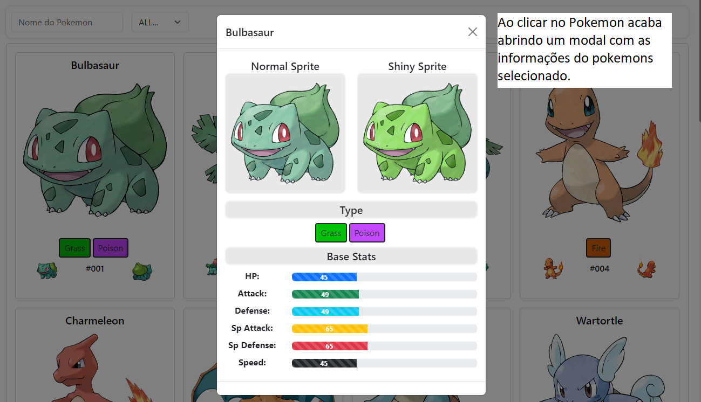

# Pokedex

Nesse projeto estarei usando a Api PokeAPI v2 
Site: [https://pokeapi.co/docs/v2](https://pokeapi.co/docs/v2)

# Descrição

Curso: SUPERIOR DE TECNOLOGIA EM ANALISE E DESENVOLVIMENTO DE SISTEMAS. <br>
Matéria: DESENVOLV DE APLICACOES P/ A INTERNET 04A-2023/2. <br>
Aluno: Victor Marinelli Montanari RA: 1950936. <br>
Link GitHub: [https://github.com/VictorMMontanari/VueAPIPokedex](https://github.com/VictorMMontanari/VueAPIPokedex). <br>
Link GitHub Pages: [https://victormmontanari.github.io/VueAPIPokedex/](https://victormmontanari.github.io/VueAPIPokedex/). <br>
Objetivo: Criar uma pokedex com utilizando o máximo de informação da API. Com objetivo de estudar como funciona a api e treinar a criação de um front-end responsivo suando bootstrap. 

# Como funciona
Aqui explicarei como funciona a Pokedex

## Filtro Pokemon



## Filtro por tipo



## Paginação


## Informação Individual do Pokemon



## Configuração Recomendada do IDE

[VSCode](https://code.visualstudio.com/) + [Volar](https://marketplace.visualstudio.com/items?itemName=Vue.volar) (e desative o Vetur) + [TypeScript Vue Plugin (Volar)](https://marketplace.visualstudio.com/items?itemName=Vue.vscode-typescript-vue-plugin).

## Personalização da Configuração

Consulte [Vite Configuration Reference](https://vitejs.dev/config/).

## Configuração do Projeto

```sh
npm install

## Compile and Hot-Reload for Development

```sh
npm run dev

## Compile and Minify for Production

```sh
npm run build
